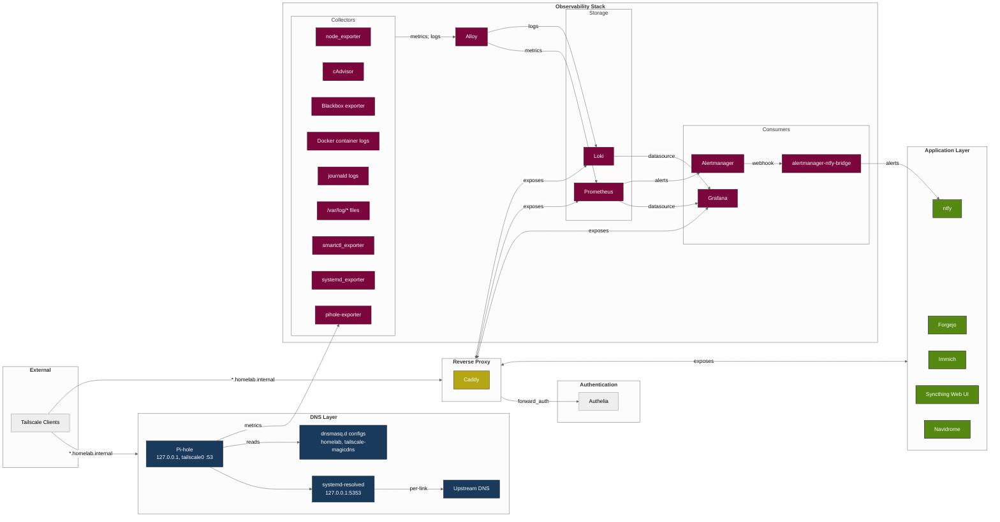

# Homelab
Self-hosted homelab on Debian 13 with rootless Docker, Tailscale mesh VPN and Pi-hole DNS. The code repository is private.

## Architecture

## Laptop Setup

```mermaid
%%{init: {
  'theme': 'neutral'
}}%%
flowchart LR
    subgraph Laptop["<b>Laptop</b>"]
        direction LR

        subgraph Collectors["Collectors"]
            direction TB
            NodeExp["node_exporter"]
            CadvisorExp["cAdvisor"]
            DockerLogs["Docker container logs"]
            JournalLogs["journald logs"]
            FileLogs["/var/log/* files"]
            SmartctlExp["smartctl_exporter"]
            SystemdExp["systemd_exporter"]
        end

        Alloy["Alloy"]
    end

    subgraph Server["<b>Server (homelab.internal)</b>"]
        Prometheus["Prometheus"]
        Loki["Loki"]
        Grafana["Grafana"]
    end

    Collectors -->|"metrics; logs"| Alloy
    Alloy -->|"metrics"| Prometheus
    Alloy -->|"logs"| Loki
    Prometheus -->|"datasource"| Grafana
    Loki -->|"datasource"| Grafana

    %% Styling
    classDef obs fill:#7a063c,color:#fff,stroke:#401020

    class Alloy,NodeExp,CadvisorExp,DockerLogs,JournalLogs,FileLogs,SmartctlExp,SystemdExp obs
    class Prometheus,Loki,Grafana obs
```

The laptop runs Alloy which collects metrics and logs locally and pushes them to the server's Prometheus and Loki instances via Tailscale.

## Services
List of all Docker container services exposed by the reverse proxy:
| Service | Domain | Port |
|---|---|---|
| Caddy | `*.homelab.internal` | 443 |
| Authelia | `auth.homelab.internal` | 9091 |
| Pi-hole | `pihole.homelab.internal` | 53, 8090 |
| ntfy | `ntfy.homelab.internal` | 1234 |
| Forgejo | `git.homelab.internal` | 3000 |
| Immich Server | `immich.homelab.internal` | 2283 |
| Syncthing | `syncthing.homelab.internal` | 8384 |
| Navidrome | `music.homelab.internal` | 4533 |
| Grafana | `grafana.homelab.internal` | 3001 |
| Prometheus | `prometheus.homelab.internal` | 9090 |
| Loki | `loki.homelab.internal` | 3100 |

Service dependencies (e.g. Immich's ML, PostgreSQL, Valkey containers for Immich) are not shown in the diagram.

## Authentication
All services are secured behind Authelia, which provides single sign-on (SSO).

## DNS
All traffic goes through Pi-hole (from host and Docker containers). At the moment only the server is using Pi-hole and other devices in the Tailnet use their default DNS.

Tailscale Split DNS maps `*.homelab.internal` → `100.xxx.xxx.xxx:53` (Pi-hole on `tailscale0` interface).

## Security
The only services exposed on `tailscale0` interface are:
- Caddy (ports 80 TCP, 443 TCP / UDP)
- Pi-hole (port 53 TCP / UDP)
- Syncthing (port 22000 TCP / UDP)

All the remaining services are bound only to `127.0.0.1` and are accessed via reverse proxy.

The host firewall (UFW) denies all incoming traffic by default, meaning the server is invisible to the public internet. Services are reachable only via Tailscale (`tailscale0` interface), which manages its own firewall rules independently. No port forwarding is required.

Self-signed SSL certificates are used. The initial idea was to use Tailscale's HTTPS provisioning. Currently, however, SSL certificates were only available for individual `*.<tailnet-domain>.ts.net` domains, with no support for wildcard certificates.

## Observability
node_exporter, cAdvisor and blackbox exporter are embedded in Alloy, while others are a separate unit.

Alloy uses a push-based model — metrics and logs are pushed to Prometheus and Loki (as opposed to the more common pull-based approach). This makes adding nodes trivial: just install Alloy on any machine in the Tailnet and point it at the server.