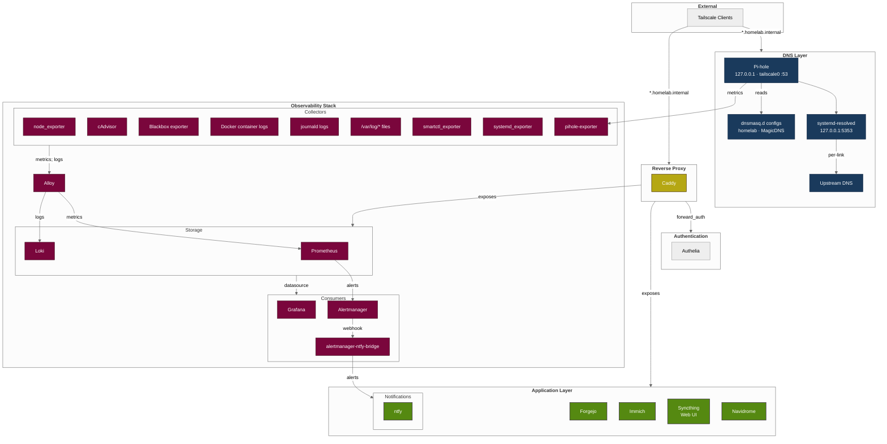

# Homelab
A self-hosted, production-oriented infrastructure environment running on Debian 13 with rootless Docker, Tailscale networking, Pi-hole DNS, centralized observability and automated infrastructure and dependency management, hosting 20+ services across staging and production environments.

Each major component is self-contained and includes its own `README.md` with deployment and configuration details.

> This repository serves as a documentation mirror, while the implementation is maintained in a private repository.

## Architecture


Services are reachable through the private Tailscale network without exposing the host directly to the public internet or requiring port forwarding. Caddy acts as the main ingress point, Authelia provides centralized authentication and Pi-hole internal DNS resolution.

Alloy collects metrics and logs from the host, containers and additional Tailnet devices, forwarding them to centralized Prometheus and Loki instances. Grafana provides visualization, while Alertmanager routes alerts to ntfy.

The homelab uses separate staging and production VMs. Changes can be tested in staging before being deployed to production.

See [`observability/`](observability/README.md) for details.

## Infrastructure Provisioning

```mermaid
%%{init: {
  'theme': 'neutral',
  'themeVariables': {
    'fontSize': '11px'
  },
  'flowchart': {
    'htmlLabels': true,
    'padding': 15,
    'nodeSpacing': 40
  }
}}%%
flowchart LR
    subgraph Build["<b>Golden Image Build</b>"]
        direction TB

        Debian["Debian 13<br/>(genericcloud QCOW2)"]
        Packer["Packer"]
        Ansible["Ansible<br/>(Docker, packages)"]
        Cleanup["Cleanup<br/>(SSH host keys, cloud-init state)"]
        Golden["Golden Image<br/>(packer-debian.qcow2)"]

        Debian --> Packer
        Packer --> Ansible
        Ansible --> Cleanup
        Cleanup --> Golden
    end

    subgraph Deploy["<b>VM Deployment</b>"]
        direction TB

        Seed["Cloud-init Seed<br/>(SSH key + hostname)"]
        Overlay["QCOW2 Overlay<br/>(backed by golden image)"]
        Terraform["Terraform"]
        Provider["libvirt Provider"]
        Libvirt["libvirt<br/>(QEMU + KVM)"]
        VM["Running VM"]
        PostSetup["Post-boot Configuration<br/>(Ansible: CA certs, homelab repo)"]

        Seed --> Terraform
        Golden -->|"Backing</br>image"| Overlay
        Overlay --> Terraform
        Terraform --> Provider
        Provider --> Libvirt
        Libvirt --> VM
        VM --> PostSetup
    end

    %% Styling
    classDef build fill:#1a3a5c,color:#fff,stroke:#0f2440
    classDef deploy fill:#558911,color:#fff,stroke:#281040

    class Debian,Packer,Ansible,Cleanup,Golden build
    class Seed,Overlay,Terraform,Provider,Libvirt,VM,PostSetup deploy
```


The pipeline builds a reproducible Debian golden image and uses it to provision fully configured VMs. A complete run typically takes ~**6 minutes**.

The production VM is managed separately from the staging VM, allowing infrastructure and service changes to be tested before deployment.

See [`iaac/`](iaac/README.md) for details.

## Repository Structure
Each top-level directory represents a self-contained component. The most significant components include:
```
.
├── auth/              # Authelia SSO (depends on Immich's PostgreSQL)
├── autoheal/          # Docker container health 
├── caddy/             # Reverse proxy (Ansible-managed)
├── forgejo/           # Self-hosted Git with CI/CD runner with ntfy integration for notifications
├── iaac/              # VM golden image pipeline (Packer + Ansible + Terraform)
├── immich/            # Photo management (server, ML, PostgreSQL, Valkey)
├── ntfy/              # Push notification server
├── observability/     # Prometheus, Loki, Grafana, Alertmanager, Alloy
├── pihole/            # DNS server and ad blocker (Ansible-managed)
└── .github/           # CI/CD workflows and ntfy-notify action
```

## Requirements
- **Host**: Debian 13 with hardware virtualization enabled, rootless Docker, Tailscale
- **Tools**: `direnv`, `just`, `ansible`
- **Access**: A device connected to the homelab tailnet

## Usage
Each directory contains its own `README.md` with specific setup and deployment instructions. General workflow:
```sh
# 1. Clone and configure
cp .env.example .env
vim .env
direnv allow

# 2. Start all services
./all.sh start

# 3. Stop all services
./all.sh stop
```

## CI/CD
The repository uses GitHub Actions to validate changes and deploy the homelab configuration to the production VM. Renovate automates dependency updates.

| Secret | Description |
|---|---|
| `NTFY_TOKEN` | ntfy access token for deployment notifications |
| `VM_SSH_PRIVATE_KEY_B64` | Base64-encoded SSH private key for VM provisioning |

## Future Work
- [ ] Add backup and restore strategy.
