# Debian VM Infrastructure Pipeline
A reproducible pipeline for building versioned Debian 13 VM images and deploying them through libvirt and QEMU/KVM.

The pipeline uses Packer and Ansible to build golden images, then creates VMs from those images either directly through libvirt or through Terraform.

## Architecture

```mermaid
%%{init: {
  'theme': 'neutral',
  'themeVariables': {
    'fontSize': '11px'
  },
  'flowchart': {
    'htmlLabels': true,
    'padding': 15,
    'nodeSpacing': 40
  }
}}%%
flowchart LR
    subgraph Build["<b>Golden Image Build</b>"]
        direction TB

        Debian["Debian 13<br/>(genericcloud QCOW2)"]
        Packer["Packer"]
        Ansible["Ansible<br/>(Docker, packages)"]
        Cleanup["Cleanup<br/>(SSH host keys, cloud-init state)"]
        Golden["Golden Image<br/>(packer-debian.qcow2)"]

        Debian --> Packer
        Packer --> Ansible
        Ansible --> Cleanup
        Cleanup --> Golden
    end

    subgraph Deploy["<b>VM Deployment</b>"]
        direction TB

        Seed["Cloud-init Seed<br/>(SSH key + hostname)"]
        Overlay["QCOW2 Overlay<br/>(backed by golden image)"]
        Terraform["Terraform"]
        Provider["libvirt Provider"]
        Libvirt["libvirt<br/>(QEMU + KVM)"]
        VM["Running VM"]
        PostSetup["Post-boot Configuration<br/>(Ansible: CA certs, homelab repo)"]

        Seed --> Terraform
        Golden -->|"Backing</br>image"| Overlay
        Overlay --> Terraform
        Terraform --> Provider
        Provider --> Libvirt
        Libvirt --> VM
        VM --> PostSetup
    end

    %% Styling
    classDef build fill:#1a3a5c,color:#fff,stroke:#0f2440
    classDef deploy fill:#558911,color:#fff,stroke:#281040

    class Debian,Packer,Ansible,Cleanup,Golden build
    class Seed,Overlay,Terraform,Provider,Libvirt,VM,PostSetup deploy
```


The pipeline consists of two stages:
1. **Golden image build** — Packer starts from the Debian 13 generic cloud image, provisions it with Ansible, and removes machine-specific state before producing a reusable QCOW2 image.
2. **VM deployment** — VMs are created from the golden image using either direct libvirt tooling or Terraform with the libvirt provider.

VMs use QCOW2 overlays backed by the golden image, allowing multiple VMs to share the same base image without duplicating the full disk.

## Requirements
- Linux host with hardware virtualization enabled in BIOS/UEFI
- `direnv`, `just`, `ansible` installed

The `just setup` command installs and configures the required virtualization stack, including QEMU, libvirt and related dependencies.

VMs currently use BIOS firmware. UEFI is untested.

## Quick Start
```sh
# 1. Configure environment
cp .env.example .env
vim .env
direnv allow

# 2. Set up hypervisor and other dependencies
just setup

# 3. Build golden image
just build

# 4. Create VM
just vm-create NAME
```

## Golden Image
The golden image is built from Debian 13's generic cloud image:
1. Provision the image with Ansible.
2. Install common system software and Docker.
3. Remove machine-specific state, including SSH host keys and cloud-init state.
4. Save the resulting image as a reusable QCOW2 golden image.

The resulting image is versioned in `manifest.json` after each build.

**Contents:**
- Debian 13 base system
- Essential packages
- Docker with rootless mode enabled
- Cloud-init support
- Common system configuration

## VM Deployment
The pipeline supports two independent VM deployment workflows:
- **Direct libvirt** using `virt-install` and `virsh`
- **Terraform** using the libvirt provider

A VM created by one workflow cannot be managed by the other. To switch workflows, destroy the VM first and recreate it using the other workflow.

### Direct libvirt
```sh
just vm-create NAME
```

This workflow:
1. Reads `~/.ssh/id_ed25519.pub`.
2. Creates cloud-init seed containing the SSH key, hostname and network configuration.
3. Builds the ISO with `xorriso`.
4. Creates a QCOW2 overlay backed by the golden image.
5. Starts the VM with `virt-install`.
6. Waits for the VM to obtain a DHCP lease and determines its IP address.

SSH into the VM:
```sh
just vm-ssh NAME
```

### Terraform
Terraform uses the libvirt provider to manage the VM lifecycle through libvirt and QEMU/KVM:
```sh
# Initialize Terraform (first time only)
just tf-init

# Plan deployment
just tf-plan -var vm_name=NAME

# Create VM
just tf-apply -var vm_name=NAME

# Destroy VM
just tf-destroy -var vm_name=NAME

# SSH into VM
just tf-ssh NAME
```
Terraform-managed VMs are tracked in `terraform/terraform.tfstate`.

## Development Workflow
Use the development VM workflow to test changes to the Ansible provisioning without rebuilding the entire golden image:
```sh
# Create a temporary VM from the existing golden image
just vm-create-dev

# Recreate the development VM from scratch
just vm-create-dev --recreate

# Clean up when done
just vm-delete dev
```
The development VM is left running for inspection after provisioning.

## VM Management
The following commands can be used to manage VMs directly through `virsh`. The corresponding `just` commands are shown where available.
```sh
# List all VMs
virsh list --all

# Start VM (or `just vm-start NAME`)
virsh start NAME

# Gracefully shut down VM (or `just vm-stop NAME`)
virsh shutdown NAME

# Force stop VM (or `just vm-force-stop NAME`)
virsh destroy NAME

# Restart VM (or `just vm-restart NAME`)
virsh reboot NAME

# Open VM console (or `just vm-console NAME`)
virsh console NAME

# Show VM information (or `just vm-status NAME`)
virsh dominfo NAME

# Show VM IP addresses
virsh domifaddr NAME
```

## SSH
Build-time and runtime SSH keys are intentionally separate:
- **Build-time:** an ephemeral keypair in `/tmp/packer_key`, removed during image cleanup.
- **Runtime:** your `~/.ssh/id_ed25519` keypair, injected into each VM through cloud-init.

## Directory Structure
```
.
├── ansible/                 # Hypervisor and dependencies setup playbook
├── packer/                  # Packer build template
├── packer-ansible/          # Golden image provisioning
├── terraform/               # VM deployment via libvirt provider
├── scripts/                 # Helper scripts
├── artifacts/               # Built golden images (gitignored)
├── .env.example             # Environment template
└── justfile                 # Build commands
```

## Debugging
To inspect the VM interactively during a Packer build:
```sh
just build-verbose
```

Then connect to the VNC display from another terminal:
```sh
vncviewer 127.0.0.1:5906
```

## Useful Commands
For offline inspection and modification of QCOW2 images:
```sh
sudo apt install -y libguestfs-tools
```