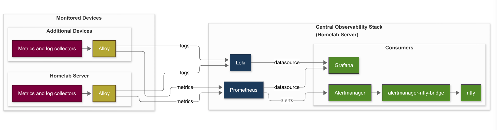
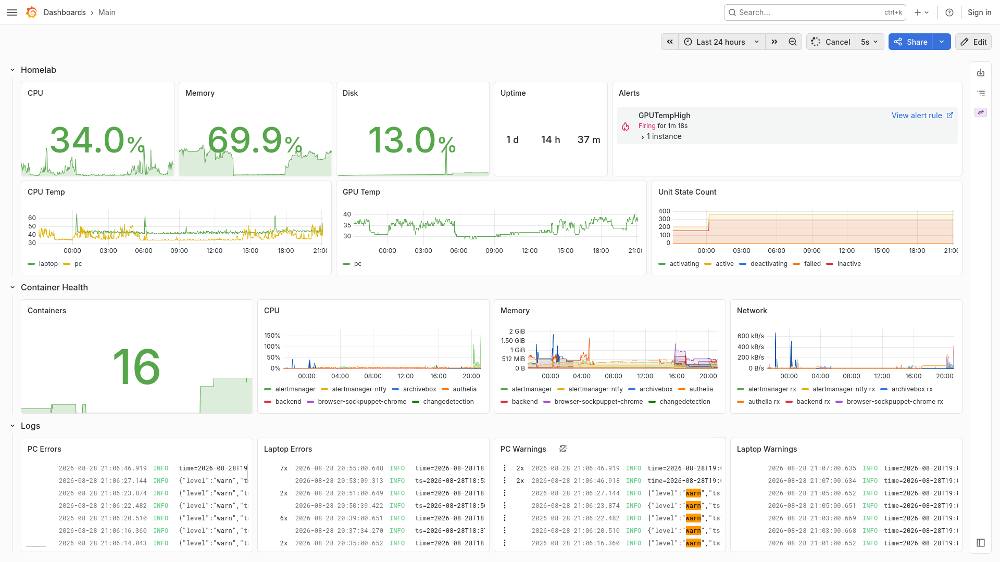
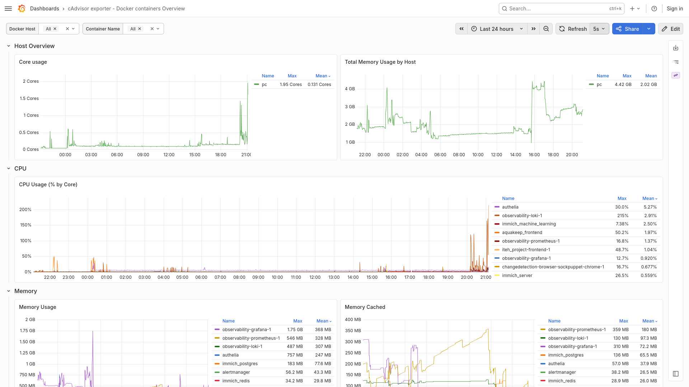
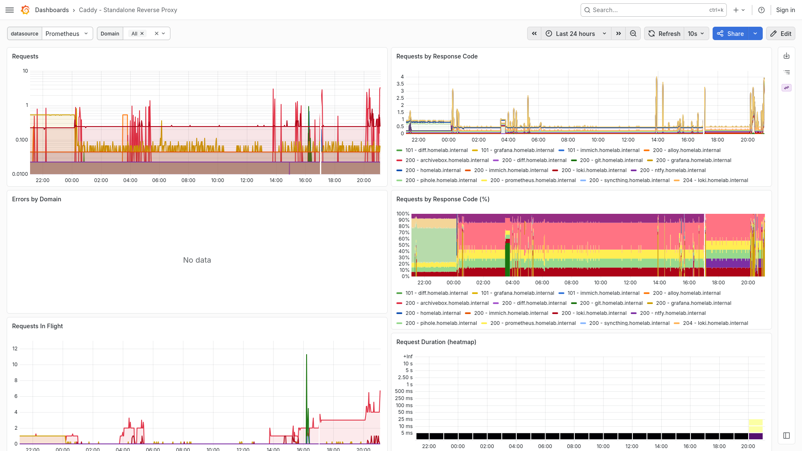
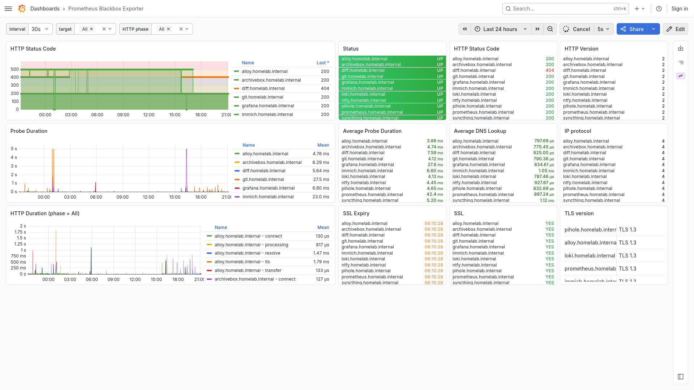
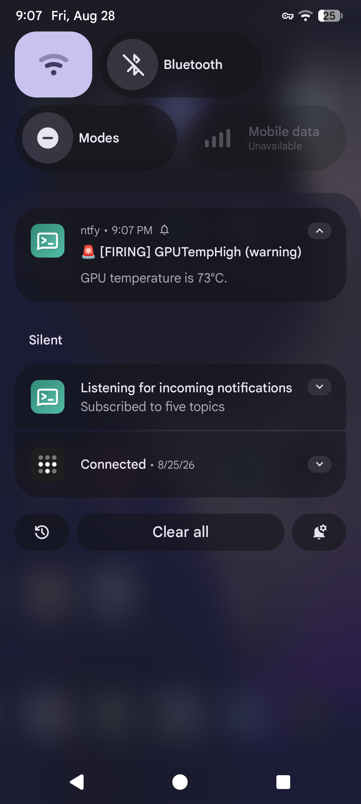

# Observability
Centralized metrics, logs and alerting for the homelab and additional Tailnet devices.

The stack uses Alloy as its telemetry collection and forwarding layer, Prometheus for metrics storage, Loki for log aggregation, Grafana for visualization and Alertmanager for alert routing. Notifications are delivered through ntfy.

## Architecture


The observability stack runs on the homelab server. Alloy collects telemetry from the host and its services and forwards metrics to Prometheus and logs to Loki. Additional Tailnet devices can run Alloy and forward their telemetry to the same central instances (push-model). Grafana visualizes the collected data, while Prometheus sends firing alerts to Alertmanager. Alertmanager forwards notifications to ntfy through `alertmanager-ntfy-bridge`.

View the code for the [diagram](./diagram.md).

## Data Collection
Alloy collects:
- **Host metrics** (Alloy's `node_exporter` integration)
- **Container metrics** (Alloy's cAdvisor integration)
- **Service availability** (Blackbox Exporter)
- **Hardware metrics** (`smartctl_exporter`)
- **Systemd metrics** (`systemd_exporter`)
- **DNS metrics** (`pihole-exporter`)
- **Caddy metrics**
- **Container logs**
- **journald logs**
- **File-based logs** from `/var/log/`

## Authentication
Observability services are accessed through the homelab reverse proxy and protected by Authelia.

Service accounts (e.g. 'metrics-pusher') are used for machine-to-machine access where required, such as metric and log ingestion.

## Usage
Install the required Ansible collections and prepare the environment:
```sh
ansible-galaxy collection install -r ansible/requirements.yaml
cp .env.example .env
vim .env
```

Set up and configure exporters:
```sh
cd ansible
ansible-playbook --ask-become-pass exporters.yaml
```

Set up and configure Alloy:
```sh
cd ansible
ansible-playbook --ask-become-pass alloy.yaml
```

Deploy observability stack:
```sh
docker compose up -d
```

### Grafana alert forwarding (manual)
After first deploy, enable Grafana-managed alert forwarding to Alertmanager via the Grafana UI (requires the source to be editable):
1. Go to `<grafana_url>/alerting/admin/alertmanager`
2. Under **Other Alertmanagers**, click **Alertmanager** → **Enable**
3. Confirm it shows 'Receiving Grafana-managed alerts'

This step cannot be provisioned via YAML — it is a one-time UI toggle.

## Screenshots

### Main Dashboard
Overview of the homelab, covering host resources, hardware temperatures, systemd and container health, alerts, container network activity, and logs. Selected CPU/GPU telemetry and logs from the laptop are also included for cross-system visibility.

<p align="center">
  
</p>

### cAdvisor Dashboard
Container-level resource monitoring with CPU, memory, network, and container
health metrics across the Docker workload.

<p align="center">
  
</p>

### Caddy Dashboard
Reverse-proxy monitoring covering request volume, response status, latency,
and traffic metrics for services exposed through Caddy.

<p align="center">
  
</p>

### Blackbox Exporter
Service availability and endpoint monitoring with HTTP status, TLS validation,
DNS lookup, probe duration, and HTTP request phase metrics.

<p align="center">
  
</p>

### Alerting
Example of a Prometheus alert routed through Alertmanager and delivered to a
mobile device through ntfy.

<p align="center">
  
</p>