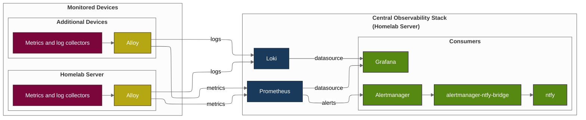

> Note: Layout 'elk' is not supported on GitHub.

```mermaid
%%{init: {
  'layout': 'elk',
  'theme': 'neutral',
  'themeVariables': {
    'fontSize': '14px'
  },
  'flowchart': {
    'htmlLabels': true
  }
}}%%
flowchart LR
    subgraph Nodes["<b>Monitored Devices</b>"]
        direction TB
        subgraph Server["<b>Homelab Server</b>"]
            ServerCollectors["Metrics and log collectors"]
            ServerAlloy["Alloy"]
            ServerCollectors --> ServerAlloy
        end

        subgraph Additional["<b>Additional Devices</b>"]
            DeviceCollectors["Metrics and log collectors"]
            DeviceAlloy["Alloy"]
            DeviceCollectors --> DeviceAlloy
        end
    end

    subgraph Central["<b>Central Observability Stack</br>(Homelab Server)</b>"]
        direction TB

        Prometheus["Prometheus"]
        Loki["Loki"]

        subgraph Visualization["<b>Consumers</b>"]
            direction LR
            Grafana["Grafana"]
            Alertmanager["Alertmanager"]
            AlertBridge["alertmanager-ntfy-bridge"]
            ntfy["ntfy"]

            Alertmanager --> AlertBridge --> ntfy
        end

        Prometheus -->|"datasource"| Grafana
        Loki -->|"datasource"| Grafana
    end

    ServerAlloy -->|"metrics"| Prometheus
    ServerAlloy -->|"logs"| Loki

    DeviceAlloy -->|"metrics"| Prometheus
    DeviceAlloy -->|"logs"| Loki

    Prometheus -->|"alerts"| Alertmanager

    %% Styling
    classDef collector fill:#7a063c,color:#fff,stroke:#401020
    classDef transport fill:#b5a713,color:#fff,stroke:#402810
    classDef storage fill:#1a3a5c,color:#fff,stroke:#0f2440
    classDef consumer fill:#558911,color:#fff,stroke:#281040

    class ServerCollectors,DeviceCollectors collector
    class ServerAlloy,DeviceAlloy transport
    class Prometheus,Loki storage
    class Grafana,Alertmanager,AlertBridge,ntfy consumer
```